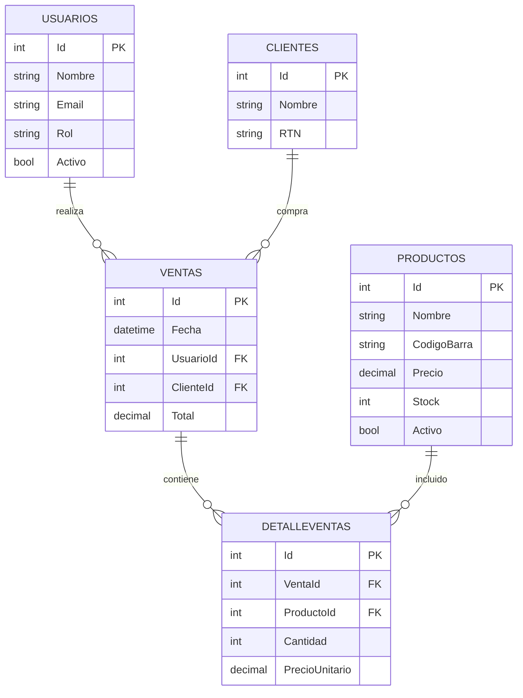

#  Sistema POS (Point of Sale)
## Informe Técnico del Sistema

---

## 1. Introducción

El presente informe describe el desarrollo de un sistema POS (Point of Sale), diseñado para gestionar operaciones comerciales básicas como ventas, control de productos, manejo de clientes y administración de usuarios.

El sistema ha sido desarrollado utilizando tecnologías modernas como ASP.NET MVC (.NET 8), Entity Framework Core y SQL Server, implementando una arquitectura basada en el patrón MVC (Modelo-Vista-Controlador) y aplicando buenas prácticas de desarrollo de software.

---

##  2. Objetivo del Sistema

El objetivo principal del sistema es facilitar la gestión de ventas en un entorno comercial, permitiendo:

- Registrar ventas de productos
- Gestionar inventario
- Administrar usuarios del sistema
- Registrar clientes
- Consultar información de transacciones

---

## 3. Arquitectura del Sistema

El sistema está estructurado bajo el patrón MVC (Modelo - Vista - Controlador), lo que permite separar responsabilidades y mejorar la mantenibilidad del código.
```
POS.Web
│
├── Models → Representación de entidades (POO)
├── Views → Interfaz de usuario (Razor)
├── Controllers → Lógica de control
├── Data → Acceso a datos (DbContext)
```

###  Descripción de Componentes

####  Models
- Representan las entidades del sistema (tablas de la base de datos).
- Se utilizan en Entity Framework para mapear datos.
- Aplican Programación Orientada a Objetos.

####  Controllers
- Gestionan la lógica del sistema.
- Reciben solicitudes del usuario desde las vistas.
- Procesan datos y devuelven respuestas.

####  Views
- Representan la interfaz de usuario.
- Permiten visualizar y capturar datos.
- Utilizan Razor para integrar lógica con HTML.

####  Data (DbContext)
- Conecta el sistema con la base de datos.
- Permite realizar operaciones CRUD.
- Gestiona las entidades mediante Entity Framework.

---

##  4. Modelo de Base de Datos

El sistema utiliza una base de datos relacional normalizada, compuesta por las siguientes tablas:

- Usuarios
- Clientes
- Productos
- Ventas
- DetalleVentas

---

##  5. Relaciones entre Tablas

###  Relaciones 1 a Muchos (1:N)

1. **Usuarios → Ventas**
   - Un usuario puede realizar múltiples ventas.
   - Cada venta pertenece a un solo usuario.

2. **Clientes → Ventas**
   - Un cliente puede realizar múltiples compras.
   - Una venta pertenece a un solo cliente (puede ser opcional).

3. **Ventas → DetalleVentas**
   - Una venta puede contener múltiples productos.
   - Cada detalle pertenece a una venta específica.

4. **Productos → DetalleVentas**
   - Un producto puede aparecer en múltiples ventas.
   - Cada registro de detalle corresponde a un producto.

---

###  Relación Muchos a Muchos (N:M)

**Ventas ↔ Productos**

- Se resuelve mediante la tabla intermedia **DetalleVentas**.
- Permite que una venta tenga múltiples productos y un producto esté en múltiples ventas.

---

##   Diagrama de Base de Datos (Mermaid)




---

##  Explicación de las Tablas

###  Usuarios

Almacena la información de los empleados del sistema (administradores y cajeros).

###  Clientes

Registra los clientes que realizan compras. Puede ser opcional en algunas ventas.

###  Productos

Contiene los productos disponibles, incluyendo precio, stock y estado.

###  Ventas

Representa cada transacción realizada en el sistema.

###  DetalleVentas

Desglosa los productos incluidos en cada venta, permitiendo manejar múltiples productos por transacción.

---

## ⚙️ 8. Flujo del Sistema

1. El usuario interactúa con la interfaz (Vista)
2. La Vista envía una solicitud al Controller
3. El Controller procesa la lógica
4. Se consulta o actualiza la base de datos mediante DbContext
5. Los datos regresan a la Vista para su visualización

---

##  Ejemplo de Componentes

###  Modelo (Model)

```csharp
public class Producto
{
    public int Id { get; set; }
    public string Nombre { get; set; }
    public string CodigoBarra { get; set; }
    public decimal Precio { get; set; }
    public int Stock { get; set; }
    public bool Activo { get; set; }
}
```

---

### 🎮 Controlador (Controller)

```csharp
public IActionResult Index()
{
    var productos = _context.Productos.ToList();
    return View(productos);
}
```

---

###  DbContext

```csharp
public DbSet<Producto> Productos { get; set; }
```

---

###  Vista (View)

Ejemplo conceptual:

* Lista de productos
* Formularios de registro
* Interfaz de ventas

---

##  10. Buenas Prácticas Implementadas

* Uso del patrón MVC
* Separación de responsabilidades
* Uso de Entity Framework Core
* Normalización de base de datos
* Uso de claves primarias y foráneas
* Validaciones en base de datos

---

## Posibles Mejoras

* Implementar encriptación de contraseñas
* Automatizar el cálculo del total de ventas
* Implementar control de inventario automático
* Agregar reportes y estadísticas
* Mejorar seguridad por roles

---

##  Conclusión

El sistema POS desarrollado cumple con los principios fundamentales del desarrollo de software moderno, integrando una arquitectura clara, una base de datos bien estructurada y una implementación funcional en ASP.NET MVC.

Este sistema puede escalar fácilmente para incluir nuevas funcionalidades como facturación electrónica, reportes avanzados y control detallado de inventario.
Este sistema puede escalar fácilmente para incluir nuevas funcionalidades como facturación electrónica, reportes avanzados y control detallado de inventario.

---
